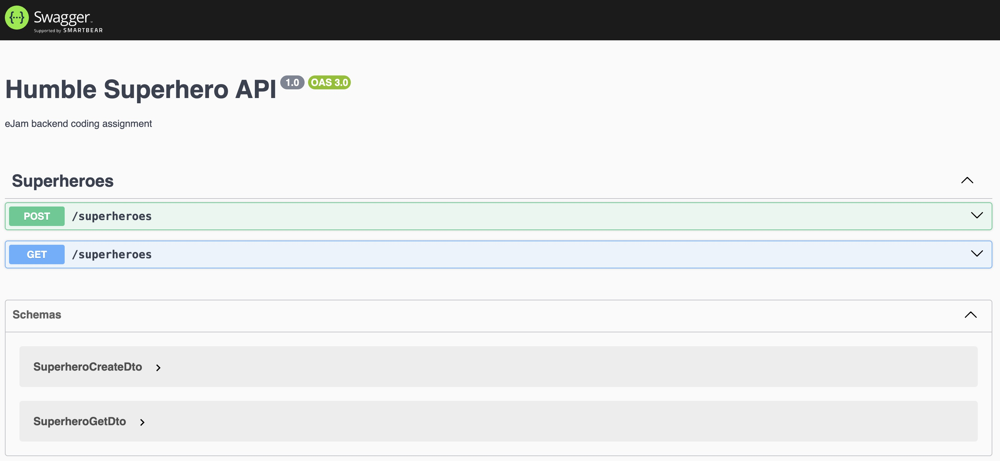
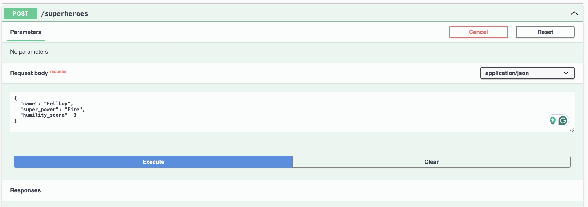
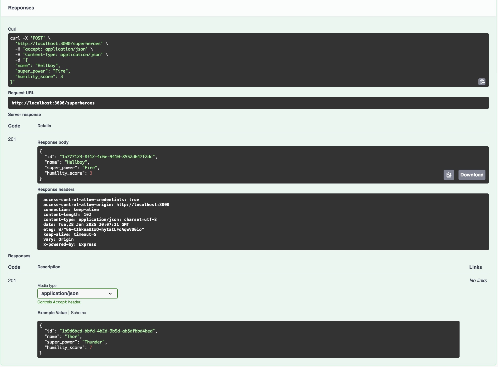
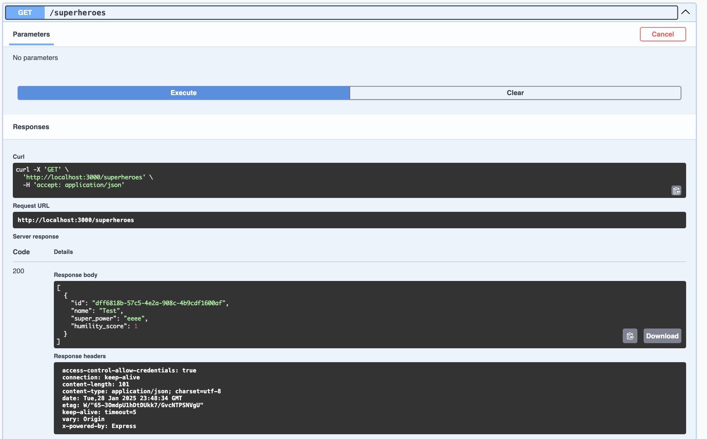

# Humble Superhero API

## Running the application

```bash
npm install
npm run start
```

## Running the tests

```bash
npm run test:e2e
```

## Directories explanation

The directory structure reflects the Domain Driven Design and Layered Architecture approach.

```
├── src
│   ├── app
│   ├── domain
│   └── infra
└── test
```

`app` - Application layer with use cases

`domain` - Domain layer with entities & services

`infra` - Infrastructure layer with different utils & drivers

---










### If I had more time:

- I would add more tests
- I would add database.
- I would move the configuration to env files.
- I would add logging.


### Demo

<iframe width="560" height="315" src="https://www.youtube.com/embed/SEZfMoaHodE?si=_rzddjKRz2bObrpa" title="YouTube video player" frameborder="0" allow="accelerometer; autoplay; clipboard-write; encrypted-media; gyroscope; picture-in-picture; web-share" referrerpolicy="strict-origin-when-cross-origin" allowfullscreen></iframe>
